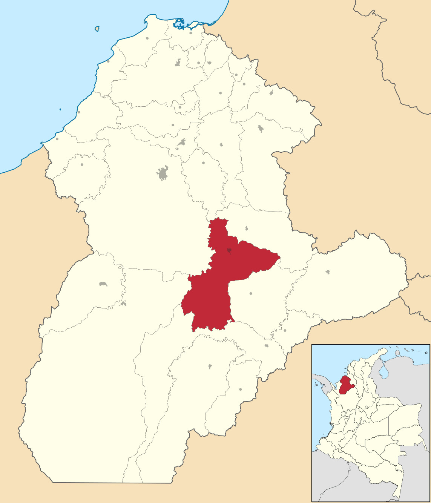

## Introducción.

En las últimas décadas, la **Variabilidad Climática (VC)** y **el Cambio Climático (CC)** han alterado profundamente los patrones pluviométricos en Colombia, afectando de manera directa la gestión de los recursos hídricos, la seguridad alimentaria y la estabilidad socioeconómica de las regiones rurales. La precipitación en el territorio colombiano se caracteriza por una alta variabilidad espaciotemporal, influenciada tanto por la compleja topografía andina como por fenómenos macroclimáticos de gran escala, principalmente el fenómeno **El Niño Oscilación del Sur (ENOS)**[@bohorquez-penuela2020].

Para municipios con una base económica agraria como **Planeta Rica, Córdoba**, comprender estas fluctuaciones es un imperativo para la planificación territorial. La evidencia científica reciente indica que, aunque algunas cuencas presentan tendencias mixtas, se ha documentado un **aumento significativo en la intensidad de eventos extremos de lluvia**.Estos episodios de *"lluvia excesiva"* —definidos técnicamente como aquellos que superan el **percentil 80** de la distribución histórica— no son simplemente eventos meteorológicos, sino auténticos **choques negativos de productividad**. Se ha estimado que tales excesos pueden provocar una disminución de entre el **2.2% y el 3% en el empleo formal rural**, afectando tanto al sector agrícola como al no agrícola, al reducir la demanda de mano de obra y dañar infraestructuras clave.[@análisis2013b]

En el departamento de *Córdoba*, este riesgo se ve exacerbado por la fase fría del ENOS, conocida como **La Niña**. Durante estos periodos, se han registrado incrementos en los caudales de los ríos de hasta un **60%**, lo que convierte a las inundaciones en el desastre socio-natural con mayor impacto histórico en la población. Además, la respuesta climática local a estas anomalías de temperatura en el Pacífico suele manifestarse con un **rezago de 2 a 3 meses**, lo que ofrece una ventana crítica para la alerta temprana y la mitigación de riesgos[@ávila2019]. No obstante, la magnitud de estos desastres no depende únicamente de la lluvia, sino de una suma **factores antrópicos** como la deforestación y la deficiente gestión del suelo, que aumentan la escorrentía y la vulnerabilidad de las comunidades.

El presente estudio analiza la serie de datos de **precipitación en Planeta Rica durante el periodo 2019-2026**. Ante la tendencia al aumento observada en la pluviosidad local, este trabajo busca documentar el comportamiento de la variable y proporcionar un marco técnico que facilite el diseño de estrategias de adaptación. El objetivo es fortalecer la resiliencia de los sistemas productivos frente a un escenario de mayor humedad, minimizando la pérdida de empleos y optimizando el uso de tecnologías de drenaje y riego para mitigar el impacto de los choques climáticos en la economía rural[@orozcob].

Más información en: - [IDEAM](https://www.ideam.gov.co/) - [Datos Abiertos Colombia](https://www.datos.gov.co/)


## Área de estudio.

Planeta Rica se localiza en el departamento de Córdoba, en la región Caribe colombiana, dentro de la cuenca del río Sinú.

{width="271"}


## Metodología.

Para analizar los patrones de precipitación en Planeta Rica se utilizó una serie temporal mensual de precipitación, almacenada en un archivo CSV denominado precipitacion_planeta_rica.csv.

**1.Datos**

El conjunto de datos incluye las siguientes variables:

fecha: fecha de registro de la precipitación (mes y año).

precipitacion_mm: valor mensual de precipitación en milímetros.

**2.Importación y preparación de datos**

Los datos fueron importados y procesados en R, asegurando la correcta interpretación de las fechas y la conversión de los valores numéricos. Se realizaron las siguientes operaciones:

*Lectura del archivo CSV*: usando la función read.csv() para cargar los datos en un dataframe.

*Conversión de fechas*: Las fechas se transformaron al formato de tipo Date para facilitar la agregación mensual y anual.

*Limpieza de datos*: Se identificaron y gestionaron valores faltantes (NA) y se revisó la consistencia de los registros.

**3.Análisis exploratorio**

Se calcularon estadísticas descriptivas para cada año y se identificaron los meses con valores máximos y mínimos de precipitación, con el fin de caracterizar la variabilidad temporal de la serie.

*Resumen anual*: Suma total de precipitación poraño.


*Máximos y mínimos mensuales*: Identificación de los meses con mayor y menor precipitación por año.

**4.Herramientas y reproducibilidad**

El análisis fue realizado en R mediante scripts reproducibles en R Markdown, con el uso de paquetes como dplyr para manipulación de datos y knitr::kable() para generar tablas resumidas. Esto permite que cualquier usuario pueda reproducir los resultados usando el mismo conjunto de datos.

```{r setup, include= FALSE}
knitr::opts_chunk$set(echo = TRUE)
library(readr)
library(dplyr)
library(ggplot2)
library(knitr)
library(lubridate)
library(leaflet)
datos <- read_csv("datosprecmes.csv")

```


## Gráfico de serie temporal de precipitación

```{r cars}

ggplot(datos, aes(x = Fecha, y = Valor)) +
  geom_line() +
  labs(title = "Serie temporal de precipitación mensual",
       x = "Fecha",
       y = "Precipitación (mm)")
```


## Tabla de resumen

```{r pressure, echo=FALSE}

tabla_resumen <- datos %>%
  group_by(Año = year(as.Date(Fecha))) %>%
  summarise(
    Total_anual = sum(Valor, na.rm = TRUE),
    precipitacion_max = max(Valor, na.rm = TRUE),
    prec_mes_max = month(
      as.Date(Fecha[which.max(Valor)]),
      label = TRUE,
      abbr = FALSE
    ),
    
    precipitacio_min = min(Valor, na.rm = TRUE),
    pres_mes_min = month(
      as.Date(Fecha[which.min(Valor)]),
      label = TRUE,
      abbr = FALSE
    )
  )

kable(tabla_resumen, caption = "**Resumen anual de precipitación en Planeta Rica**")


```


## Mapa interactivo.

```{r, echo=FALSE}
leaflet() %>%
  addTiles() %>%
  setView(lng = -75.584, lat = 8.411, zoom = 9) %>%
  addMarkers(lng = -75.584, lat = 8.411,
             popup = "Estación meteorológica - Planeta Rica")

```


## Bibliografia.
